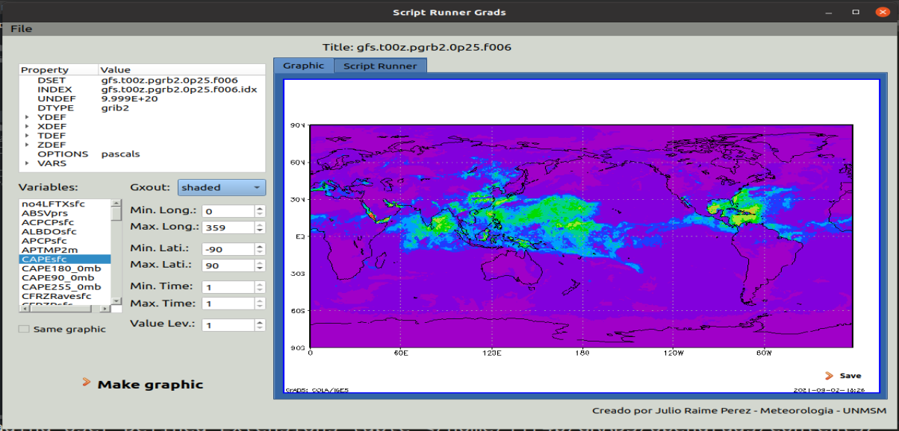

# pysrgrads

SRGrads fue creado con el objetivo de poder interactuar de una manera más sencilla con los archivos CTL y el sistema de análisis y visualización de cuadrícula GrADS, de modo que el usuario se enfoque más en la visualización correcta de los datos, sin preocuparse del código .gs, esto permitirá que el usuario utilice de manera más fluída el software sin necesidad de utilizar el terminal.

SRGrads brinda a los usuarios las siguientes funcionalidades:
<ul>
  <li>Leer archivos CTLs: Al abrir un archivo CTL vamos a poder visualizar en el programa las diferentes propiedades del archivo.</li> 
  <li>Gráfico de variables: Luego de abrir el archivo CTL podemos graficar alguna variable</li>
  <li>Generación de script: Al graficar una variable, internamente se crea un script .gs de modo que el usuario puede visualizar y/o modificar el script en la sección ‘Script Runner’</li>
  <li>Visualizar gráfico de script: Si el usuario ingresa un script en la sección ‘Script Runner’ el cual genere una imagen, entonces, la imagen será visualizada en la sección ‘Graphic’</li>
  <li>Guardar gráfico: El programa permite exportar la imagen generada en el formato PNG para que pueda guardarlo en la carpeta deseada</li>
  <li>Guardar script .gs: El programa permite exportar el script generado y guardarlo con el formato .gs en la carpeta deseada</li>
</ul>

### Pre requisitos
Para poder utilizar SRGrads debemos tener en cuenta lo siguiente:
<ol>
  <li>GRADS: Debemos tener instalado GRADS en la ruta $HOME, puede descargarlo <a href="http://cola.gmu.edu/grads/downloads.php">aqui</a></li>
  <li>grib2ctl: Debemos descargar el archivo grib2ctl.pl y guardarlo en la ruta $HOME/GRADS/opengrads/Contents</li>
  <li>wgrib: Debemos instalar wgrib en nuestro sistema</li>
  <li>
    Python: SRGrads se creó utilizando la versión 3.8.10, sin embargo, debe estar disponible utilizando cualquier versión de Python: 3.5+, además:
    <ol>
      <li>CMake: 3.1+</li>
      <li>PyQt5: se puede instalar en Linux utilizando las instrucciones <a href="https://gist.github.com/ujjwal96/1dcd57542bdaf3c9d1b0dd526ccd44ff">aqui</a> </li>
    </ol>
  </li>
</ol>

### Instalación
Podemos instalarlo descargando los archivos desde github si deseamos modificar el diseño con QTDesigner, sin embargo, también podemos hacerlo usando pip3 con el comando "pip3 install pysrgrads".

* Si de descarga de github, debemos ejecutar el archivo 'testSRGrads.py'
* En caso se instale con pip3, se necesita usarlo con los siguientes comandos:
*   from pysrgrads.pysrgrads import SRGrads
*   root = SRGrads()
*   root.show()
